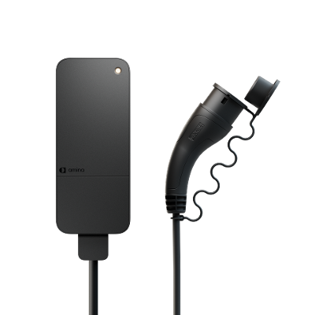

# amina_s
Zigbee2MQTT external converter for Amina S EV Charger

Created by @somlioy

|     |     |
|-----|-----|
| Model | amina S  |
| Vendor  | amina distribution AS  |
| Description | Amina S EV Charger |
| Exposes | state, charge_limit, ev_status, power, current, total_active_energy, last_session_energy, alarms, alarm_active, ac_frequency, voltage, voltage_phase_b, voltage_phase_c, current_phase_b, current_phase_c, linkquality |
| Picture |  |

The EV Charger requires atleast firmware version 1.5.3 to have support of every expose of this external converter.
You can check the firmware version by reading the `swBuildId` attribute in cluster `genBasic`, endpoint `10` after pairing, by using the Dev console in Zigbee2MQTT.

As of now, the exposes `total_active_energy` and `last_session_energy` is not updated automatically as the attributes are not reportable.

The `ev_status` attribute is an enum which can be any of the following values:

| `ev_status` |
| --- |
| Unknown status: *#status*
| Not connected |
| EV Connected |
| Ready to charge |
| Charging |
| Paused |

Where `#status` is the bit coded integer recieved from the device.

The `alarms` attribute is an array which can hold any combination of the following values:

| `alarms` |
| --- |
| Welded relay(s) |
| Wrong voltage balance |
| RDC-DD DC Leakage |
| RDC-DD AC Leakage |
| Temperature error |
| Overvoltage alarm |
| Overcurrent alarm |
| Car communication error |
| Charger processing error |
| Critical overcurrent alarm |

## Installation (Zigbee2mqtt stand-alone)

Please see https://www.zigbee2mqtt.io/guide/configuration/more-config-options.html#external-converters for how to install the external converter.

## Installation (Zigbee2mqtt Home Asisstant add-on)

1. In your `zigbee2mqtt` data folder, next to the `configuration.yaml` file, add `amina_s.js`.
2. Open your Zigbee2MQTT addon Web UI, navigate to settings, then external converters
3. Click the '+' button, and type `amina_s.js` into the text box which appears.
4. Click submit and restart Zigbee2mqtt

## Pairing
When Amina S is powered up it will start looking for networks to join. If it has been associated with a network it will try and find this network.

Amina S will for the first 5 minutes after power on event look for a network to join on all Zigbee channels in the 2.4GHz range intensively, and then gradually look for networks with less and less "eagerness". This means that the highest probability of finding a network will be the first 5 minutes after power on.

You can use the install code to facilitate the joining process.